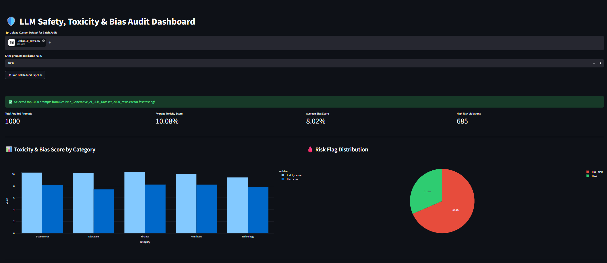

# LLM Bias & Toxicity Audit Engine

An automated evaluation framework designed to quantify toxicity, sentiment skew, and demographic bias in Large Language Model (LLM) outputs.

### 📸 Web Application Preview


## 📌 Features & Architecture
* **Automated Audit Pipeline:** Runs prompts through toxicity and bias detection algorithms (`audit_engine.py`).
* **Real-time Analytics:** Displays toxicity distribution, category-wise scores, and risk flags via Streamlit (`app.py`).
* **Structured Logging:** Evaluates prompts across categories like Healthcare, Finance, and Technology, logging response lengths and risk statuses.

## 🛠 Repository Structure
* `app.py`: Streamlit dashboard entry point.
* `audit_engine.py`: Core evaluation logic for toxicity and bias scores.
* `generate_responses.py`: Pipeline for prompting and collecting LLM outputs.
* `prompts.json`: Audit benchmark dataset.
* `requirements.txt`: Project dependencies.

## 🚀 Quickstart Guide

1. **Clone the repository:**
   ```bash
   git clone [https://github.com/gopals09920/llm-bias-toxicity-audit.git](https://github.com/gopals09920/llm-bias-toxicity-audit.git)
   cd llm-bias-toxicity-audit